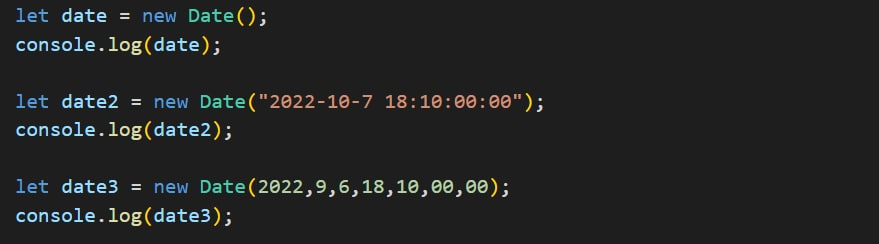
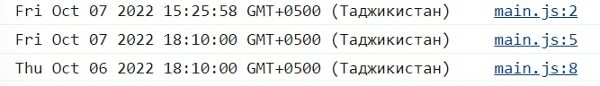
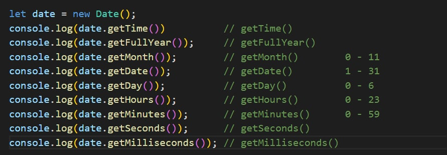
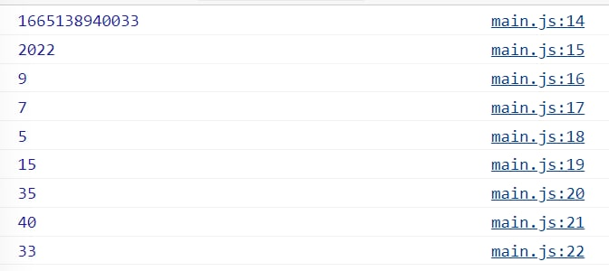
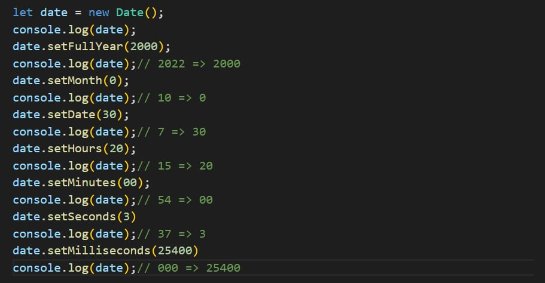
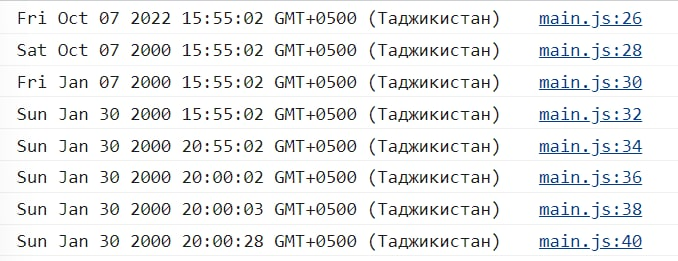
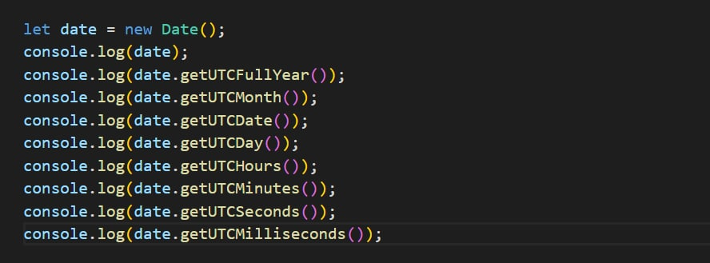
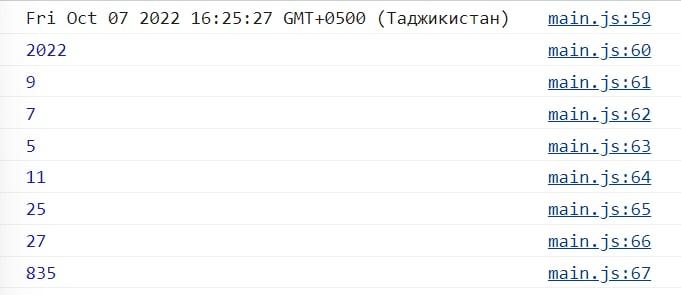
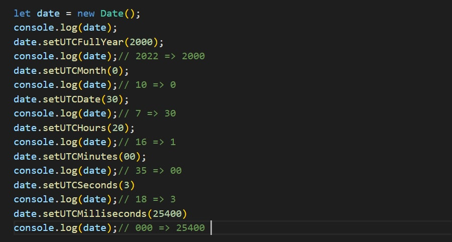
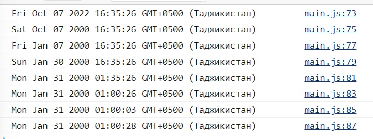

# Date and time in javascript!
#
#
# What is it Date and time in js?
#
##### Date and time in JavaScript are represented by the Date object. You
            can't create "only date" or "only time": Date objects always contain both.

# Date methods
## Methods get

## Methods set

# What is it UTC
#
##### PHP is set to GMT and JavaScript is set to UTC; how do these
            standards differ, and could this be causing the problem? If you
            strictly go by the definition of what UTC and GMT are, there is no
            real practical difference as others have pointed out.

## Methods getUTC

## Methods setUTC

